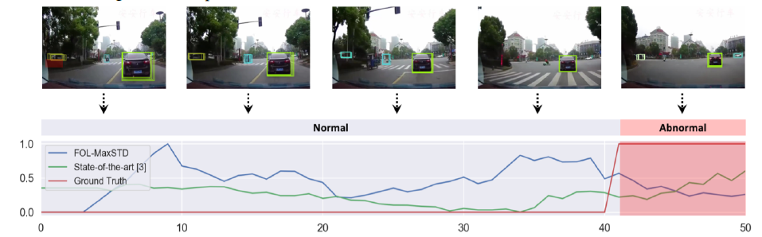

# Unsupervised Traffic Accident Detection in First-Person Videos

> [İlgili Makale](https://github.com/afozbek/arac-kaza-tespiti/tree/84ec87d7a25201fe9e05970f9d8971daafdb898c/pdfs/Unsupervised%20Traffic%20Accident%20Detection%20in%20First-Person%20Videos.pdf)

## Table Of Contents

* [Açıklama](unsupervised-traffic-accident-detection-in-first-person-videos.md#açıklama)
* [Önemli Noktalar](unsupervised-traffic-accident-detection-in-first-person-videos.md#Önemli-noktalar)
* [Future Object Localization \(FOL\)](unsupervised-traffic-accident-detection-in-first-person-videos.md#future-object-localization-fol)
* [Ekran Görüntüleri](unsupervised-traffic-accident-detection-in-first-person-videos.md#ekran-görüntüleri)

### Açıklama

Bu makalede hareket halindeki kameralardan ve kazaya karışan araçlardaki kameralardan elde edilen verilerle Unsupervised olarak trafik kazası belirleme algoritmaları ele alınmıştır.

### Önemli Noktalar

* **Odometry:**  Hareket sensörlerinden elde edilen verileri kullanarak zaman içindeki konum değişikliğini hesaplama yöntemidir.
* **Trajectory Prediction:** Aracın izleyeceği yörüngeyi tahmin etme
* **RNN-ED\(Recurrent Neural Networks Encoder-Decoder\):** Autonomous driving için gelecek konum tahmininde kullanılan bir mimaridir.
* **STAG \(Spatio-Temporal Action Graph\) Network:**  Nesneler arasındaki uzaysal ve geçici ilişkileri modellemek için kullanılan bir yapıdır.
* **FOL:** Future Object Localization \(Modelimizde kullanılan yöntem\)
* **Bu modelde AnAn Accident Detection \(A3D\) dataseti kullanılmıştır.**

### Future Object Localization \(FOL\)

* Bu model bir nesnenin görünen yörüngesi tahmin edilen yörüngesinden saparsa bir anomalinin var olabileceğini varsayar. Model tamamen normal, anomali içermeyen videolarla eğitilmiştir. Bu sayede tüm anomali ihtimallerinin gösterilmesine gerek kalmadan model olası bir anomaliyi seçebilmektedir. Ayrıca bu dataset elde edilmesi kolay ve elle etiketlemeye de ihtiyaç duymuyor.

_1. Bounding Box Prediction:_

* Multistream RNN encoder-decoder framework kullanılarak oluşturulmuş bir modeldir. Görünen nesnenin "Bounding Box"'ı t anında Xt=\[ctx,cty,wt,ht\] olarak belirlenir. ctx ve cty kutunun merkezinin koordinatlarını, wt ve ht ise sırasıyla kutunun piksel cinsinden genişliğini ve yüksekliğini belirtir.
* Nesnenin tahmini yörüngesini elde etmek için kullanılan formül ise Yt={Yt+1,Yt+2,...,Yt+δ} şeklindedir.
* **Model her bir frame için karar vermeden önce önceki 10 frame üzerinde işlem yapar.**

_2. Ego-Motion Cue:_

* Et={Φt,xt,zt} Belirtilen formülde sırasıyla, yoldan çıkma açısı ve ilk frame'e göre aracın yer düzlemindeki koordinatları temsil edilmiştir.
* Aracın konumundaki değişimin vektörünü kodlamak\[1\] ve gelecekteki konum değişikliklerini decode etmek\[2\] için; odometrisini RNN-ED modülü kullanarak tahmin etmeye çalışır.

**\[1\]:Et - Et-1**

**\[2\]:E={Êt+1-Et,Êt+2-Et,...,Êt+δ-Et}**

* Odometri hatalarını gidermek için aracın konumundaki değişikliği kullanır.

_3. Missed Objects:_

* Her nesnenin şimdiki bb\(bounding box\)'si, gelecekteki bb'leri ve listenin yaşını tutması için bir Trks\[i\] tracker listesi oluşturulur.

#### Sonuç olarak;

* Bu makalede birinci kişi açısındaki videolardan trafik kazası tespiti için unsupervised deep learning framework kullanımı ele alınmıştır. Önerilen modelde trafikteki nesnelerin yörüngeleri ve gelecekteki konumları tahmin edilmiş ve beklentilerin doğruluğu ve tutarlılığı, bir anomalinin gerçekleşmiş olabileceğine dair sinyaller olarak kullanılmıştır.

### Ekran Görüntüleri

  

