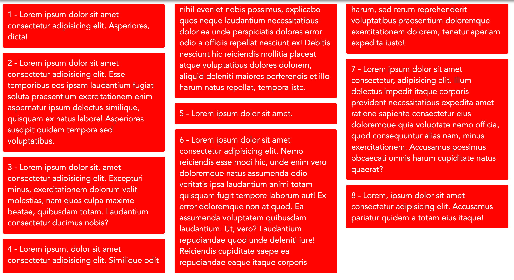
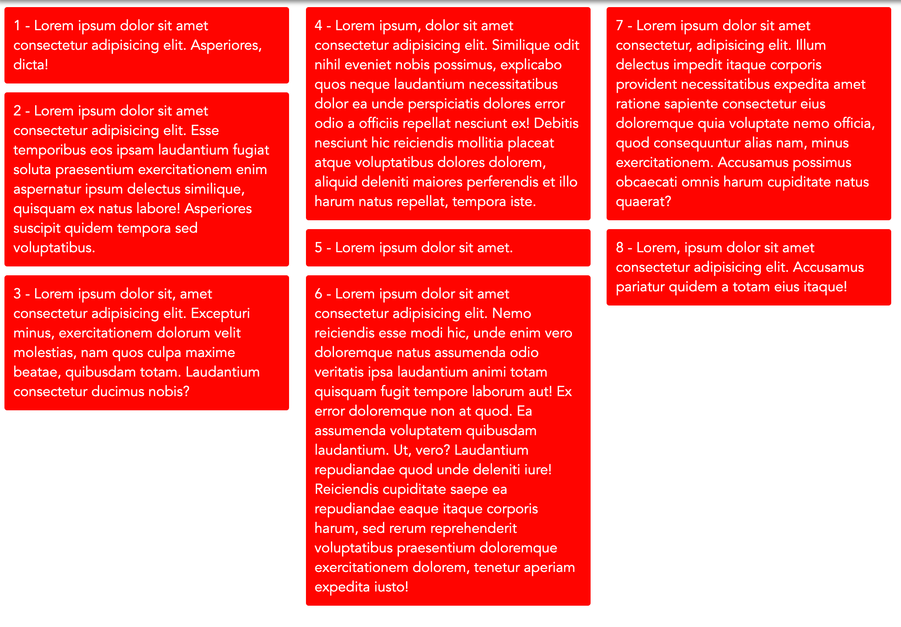

# Masonry Layout


### Masonry Layout Nedir?

Masonry layout web sayfalarında, columlarla birlikte kullanılan, grid tabanlı bir layout çeşididir. Diğer grid layout lara nazaran masonry layout da belirli bir **height**\(yükseklik\) değeri yoktur. Bu yüzden masonry layout bu durumu en optimize bir şekilde web sayfasına aktararak tasarımı farklı kılar.


### Web Üzerinde Masonry Layout Kullanımı

Masonry tasarımı, sitenin tasarımını geliştirmekle siteyi daha işlevsel de kılmaktadır. Aşağıda bu tasarımı sitelerinde sergileyen bazı örnek siteler yer almaktadır.

* [Pinterest](http://www.pinterest.com/) 
* [THEWALL](http://thewall.sofarider.com/) 
* [Erik Johansson Photography](http://erikjohanssonphoto.com/work/imagecats/personal/) 
* [hereason.us](http://thereason.us/) 

### Masonry Layout'un Kullanım Alanları

Masonry layout sitenin dizaynını geliştirmekle kalmaz aynı zamanda fonksiyonelliğini de güzelleştirir.

Kullanabileceğimiz alanlara gelince;

* **Resim Galerileri** – Resim galerileri, birden çok farklı resimden oluşan ve her resimin birbirinden farklı yükseklik ve genişlik değerlerine sahip olabileceği yerlerdir. Resimlerinin kalitelerini kaybetmeden bunları normal grid yerleşiminde göstermek bir hayli zor olabilir. Masonry layout ile farklı boyutlardaki resimler çok kolay bir şekilde grid de gösterilebilir.
* **Blog Posts** – Blog sayfalarımızda göstermek istediğimiz blog postlarımızın açıklama kısımları birbirinden çok farklı olabilmektedir. Grid de bunlar bariz bir şekilde garip görünecektir. Masonry layout u ile bu sıkıntılar halledilecektir.
* **Portfolios** –  Portfolio sayfalarında gösterebileceğimiz projelerimiz, resimlerimiz, yaptığımız dizaynalar veya farklı bir çok özellikleri profil sayfamızda masonry layout ile sergileyebiliriz.

### Masonry Layout Uygulamadan Önce

Şu zamana kadar Masonry layout un ne olduğunu konuştuk fakat bu tasarımı uygulamak için daha bir çok farklı yöntem bulunmaktadır. Sitenize bu tasarımı uygulamadan önce şunlara dikkat etmeniz size fayda sağlayacaktır;

* Bu tasarımı kullanmak için grid yapısına ihtiyacınız vardır.
* Görüntülenecek öğelerin farklı boyutlarda olması gerekir ki bu tasarım bunu hedefliyor.
* Tasarım efektlerinin gerçekten anlaşabilmesi için belirli sayıda örneğin sergilenmiş olması gerekiyor.

### Masonry Layout Oluşturma 

Masonry Layout ları ekleyebileceğimiz bir sürü farklı yol olsa da bunları CSS ve Javascript olarak iki farklı parçada nasıl uygulayabileceğimizi gösterecek olursam;

#### 1 - CSS 

CSS tarafında birden çok farklı yöntemle masonry layout uygulanabilir. 

* Flexbox
* Grid
* Fixed Heights ve Auto Margins

Fakat ben uygulaması en kolay olan ve araştırmalarım arasında en kolay olan yapıyı sizlere göstermek istiyorum.

* `column-count`

`column-count` property si grid ile gelen fakat grid uygulanmadan da container lar tarafından uygulanabilen ve tarayıcı uyumluluğu bir hayli iyi olan bir css özelliğidir. Tek yapmamız gereken uygulamak istediğimiz container'a bu özelliği vermek ve istediğimiz column sayısını belirtmektir. Responsive olarak da tek yapmamız gereken farklı cihaz boyutlarındaki column sayısını değiştirmektir. Gerisini `column-count` bizim için halledicektir. 

```css
.container {
  column-count: 3;
  max-width: 1000px;
}

.box{
  width: 300px;
  margin-bottom: 10px;
  
  padding: 10px;
  border-radius: 3px;
  
  background: red;
  color: white;
}  
```



Fakat görebileceğiniz üzere **6. kutuda** column tam olarak istediğimiz formatta değil. Bunun gibi kayma durumlarını kaldırmak için bir başka css property si olan `break-inside` kullanmamız gerekicektir. break-inside default olarak bu wrap olayına izin verir. Bu yüzden her bir box class ımıza şu satırları de eklememiz gerekiyor;

```css
.box{
  width: 300px;
  margin-bottom: 10px;
  
  padding: 10px;
  border-radius: 3px;
  
  background: red;
  color: white;
  
  break-inside: avoid;
}  
```



Gördüğünüz üzere break inside ile çok kolay bir şekilde oluşan kayma sıkıntısını çözmüş olduk.

Eğer column lar arasına boşluk bırakmak istiyorsak bunu da yine grid property si olan **column-gap** ile yapabiliriz.

```css
.container {
  //...
  
  column-gap: 10px;    
}
```

#### 2 - Javascript

Masonry Layout'u kullanabileceğimiz javascript pluginlerini de paylaşacak olursak;

* [Masonry](http://masonry.desandro.com/) 
* [Wookmark](http://www.wookmark.com/jquery-plugin) 
* [Isotope](http://isotope.metafizzy.co/) 
* [Nested](http://suprb.com/apps/nested/) 
* [Freetile.js](http://yconst.com/web/freetile/) 

### Son Sözler

Kodların yapıldığı codepen linkine buradan ulaşabilirsiniz



### Yararlanılan Kaynaklar 📚

* [Understanding Masonry Layout by Rakhitha Nimesh](https://www.sitepoint.com/understanding-masonry-layout/)
* [How to Pure CSS Masonry Layouts by Jhey Tompkins](https://codeburst.io/how-to-pure-css-masonry-layouts-a8ede07ba31a) 
* [Approaches for a CSS Masonry Layout by Chris Coyier](https://css-tricks.com/piecing-together-approaches-for-a-css-masonry-layout/)
* [How to The Masonry Layout by Jhey Tompkins](https://codeburst.io/how-to-the-masonry-layout-56f0fe0b19df)

### İletişim Halinde Olalım 😊

Benimle sosyal medya hesaplarım aracılığıyla iletişime geçebilirsiniz.

* [Linkedin Hesabım](https://www.linkedin.com/in/afozbek/)
* [Github Hesabım](https://github.com/afozbek)
* [Twitter Hesabım](https://twitter.com/afozbek_)

