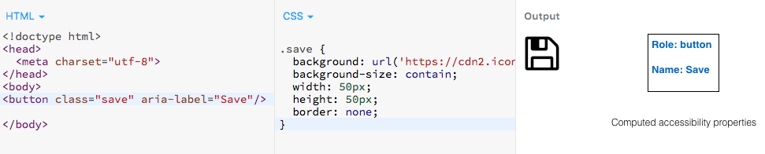
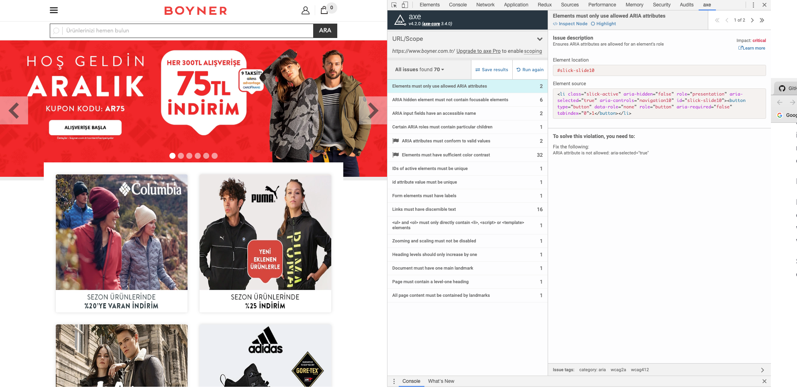
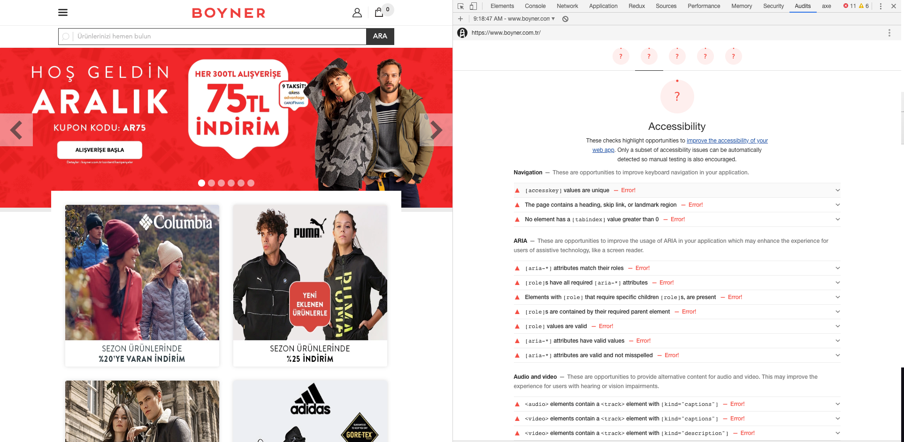
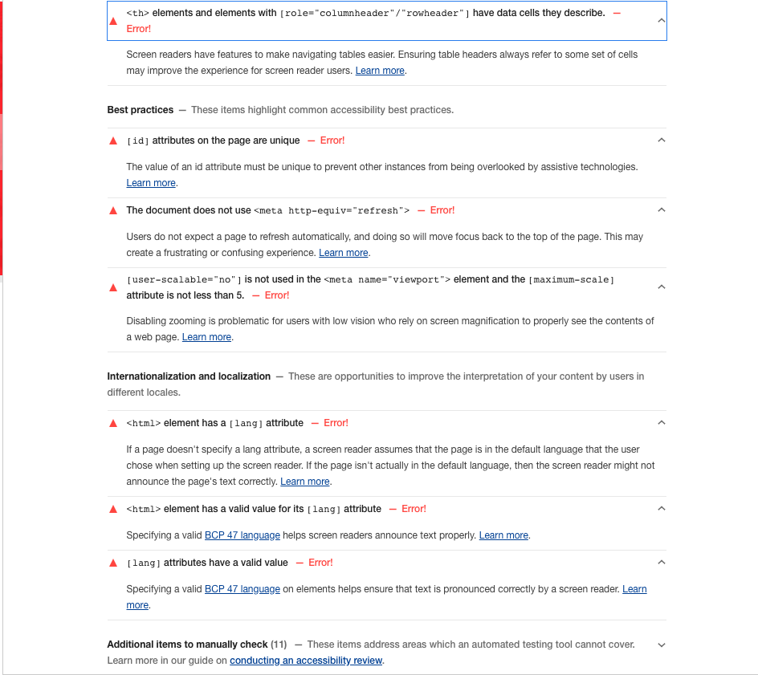

# Web Accessibility Notlar

## What is Web Accessibility

Accessibility is strongly related to universal design which is the process of creating products that are usable by people with the widest possible range of abilities, operating within the widest possible range of situations. This is about making things accessible to all people \(whether they have a disability or not\).

> Making an accessible site means making it for ‘almost’ everyone.


The power of the Web is in its universality. Access by everyone regardless of disability is an essential aspect.

                          -- _Tim Berners-Lee, W3C Director and inventor of the World Wide Web_ 


Web accessibility means that websites, tools, and technologies are designed and developed so that people with disabilities can use them. \(Web erişilebilirliği, web sitelerinin, araçların ve teknolojilerin engelli kişilerin bunları kullanabileceği şekilde tasarlandığı ve geliştirildiği anlamına gelir.\)

 More specifically, people can:

* perceive, understand, navigate, and interact with the Web
* contribute to the Web

Web accessibility encompasses all disabilities that affect access to the Web \(Web erişilebilirliği, Web'e erişimi etkileyen tüm engelleri kapsar\) 

Including:

* auditory \(işitsel\)
* cognitive \(bilişsel-idrak\)
* neurological \(nörolojik, sinirsel\)
* physical \(fiziksel\)
* speech \(konuşma\)
* visual \(görme\)

Web accessibility also benefits people without disabilities.

For example:

* people using mobile phones, smart watches, smart TVs, and other devices with small screens, different input modes, etc.
* older people with changing abilities due to ageing
* people with “temporary disabilities” such as a broken arm or lost glasses
* people with “situational limitations” such as in bright sunlight or in an environment where they cannot listen to audio
* people using a slow Internet connection, or who have limited or expensive bandwidth

## Key Features When Developing Accessible Websites

### Semantics

HTML \(Hyper Text Markup Language\) is exactly that: a markup language. This means that it is not only plain text, but text marked up with meaning - so called "semantics". For this, HTML offers a lot of tags, each with an inherent, unique semantic meaning. And it is absolutely crucial that those tags are used properly.

#### Tags with No Meanings

To understand the importance of proper semantics, let's first look at the exceptions: tags that indeed do not provide semantical information.

There are only two tags in HTML that do not have any semantic meaning: `<div>` and `<span>`. Their purpose is to offer containers needed for visual styling. And their only difference is that `<div>` is a block element, while `<span>` is an inline element.

#### Tag with Meanings

Content elements are used to give meaning to content \(like headings, paragraphs, or links\). Marking up text using an `<h#>` tag tells the user agent that this is not just plain text, but - in fact - a heading of a certain level!

Structural elements are used to group elements on a webpage, separating them into different regions \(like header, navigation, main, or footer\). They have been introduced in HTML 5.

### Keyboard accessible

**All the interactive elements of your page** e.g. text boxes, buttons etc should be accessible by keyboard. That means you should be able to bring focus on them by using **Tab and Shift+Tab** keys.

Most of the interactive elements are keyboard accessible by default, i.e. browser takes care of making them keyboard ‘focus-able’.

Non interactive elements like div, span and images are not keyboard accessibly by default. This is fine because users don’t generally need to interact with them.

### Tab-order

* The order in which elements get focus is called tab-order. Developers need to take care that the interactive elements have logical tab-order. Tab order should follow the natural reading sequence i.e. top to bottom and right to left \(for an RTL type language\). If your tab focus is jumping around the page unpredictably then its not going to be great experience for the users.
* Tab-order mainly depends on the **dom-order,** i.e. the way you have written your html. Any element which is ahead in the dom tree automatically goes ahead in the tab-order.
* Sometimes people use css to make the element appear in an order which is different form dom-order. Example

```markup
<a href="#" style="float:right;">Right aligned link</a> 
<a href="#">Link 1</a> 
<a href="#">Link 2</a>
```

* In above example first the focus will move to right and then it will come to left because right aligned link appears above in dom. That’s not great because you would generally expect leftmost link to be focussed first. 

This is how you can **solve** it:

```markup
<a href="#">Link 1</a> 
<a href="#">Link 2</a> 
<a href="#" style="float:right;">Right aligned link</a>
```

**INERT** is a javascript library which makes part of the application focusable or unfocusable. Under the hood it adds `tabindex="0"` or `tabindex="-1"` to the element.



### tabindex

Recommended Usage **0 for tab accessible** and **-1 for tab unaccessible**

* To make a non interactive element focusable you can give it `tabindex="0"` attribute. This not only makes the element **tab accessible** but also makes it programmatically **focusable**. That means you can call **.focus\(\)** on that element.
* `tabindex="-1"` will take out any interactive element from tab-order. That means you can not access it through keyboard. This is particularly useful when you want to make few links/buttons inaccessible when they are behind an overlay or transitioned out of display \(e.g. hamburger menus\)
* Positive tabindex value makes the element tab accessible and also puts the element ahead in tab-order based on the value of the attribute. But positive tabindex values are considered anti-pattern becuase it may get very confusing more than one elements have positive tabindex values. So, **don’t** **use** positive tabindex.

### Use native elements



* As far as possible please use native elements for any specific purpose. That means, for example, if you need a button then just use button tag rather than making a button using divs or spans.
* Native interactive elements like buttons, select boxes etc have many built in accessibility features which you might miss if you are creating your own.

### Guideline for custom elements

* If you must create a custom element then make sure that you go through the wai-aria best practices guide: [WAI-ARIA Authoring Practices 1.1](https://www.w3.org/TR/wai-aria-practices-1.1/)
* These guidelines tell you how the keyboard interactions should be for any element. It also has links to demo and code examples for our help.





### Screen readers

* Many users with visual impairment rely on assistive tools like screen readers to get information on the page and to interact with page
* Always use **alt attribute** for images. Screen readers would read out the alt text for its users who have difficulty in seeing the image.
* Use proper heading tags, etc for headings, because screen readers allow users to navigate within the content of page using headings.
* Make efficient use of semantic tags like `<header>, <footer>, <section>, <nav>`  etc because screen readers allow users to navigate within the content of page using these tags.
* Screen readers need to identify the interactive elements correctly so it can ask users to interact with them. For example, if you have created a button using `<button>` tag then screen reader will call it out as button. But if your button is something like `<div class="fancy button">Submit</div>` then screen reader will call it a “**group**” because div is grouping element, and user would not understand that they are supposed to interact with that element.

**How HTML elements are supported by screen readers**



### **Labels and aria attributes**

There are indeed situations where standard HTML **does not** provide functionalities for all the requirements developers may have for implementing modern and interactive websites. For this, the _Accessible Rich Internet Applications \(ARIA\)_ technical specification was introduced.

* Any code written in html not only has a visual representation but also has a semantical representation called _accessibility tree_. Accessibility tree is used by assistive tools like **screen readers** to inform the user about the accessibility properties like **type, name, state and value** of the element. The values of these accessibility properties are computed by browser based on the information provided in **html code**.


* In above example name is computed by the  tag. **Make use of label tag wherever applicable.**
* Use **aria-label** attribute to ensure that element has a name. Suppose you have a save button which does not have a text content, then browser will not be able to compute its name. We can mention aria-label attribute to help browser compute its name.



* Similarly use different aria attributes like role, **aria-labelledby, aria-expanded, aria-checked \(etc..\)** to help browser compute accessibility properties:



### **Use tools**

* [aXe](https://chrome.google.com/webstore/detail/axe/lhdoppojpmngadmnindnejefpokejbdd) is an amazing tool to identify the accessibility gaps in your page. It is a chrome extension. Install it and use through chrome dev tools to analyse the accessibility of the page.
* Use aXe to analyse colour contrast in your page. A bad colour contrast ratio will make it difficult for few users to read the text. aXe can point out the regions of your page where the contrast does not match the [WCAG guidelines](https://www.w3.org/TR/WCAG20/#visual-audio-contrast).
* Chrome has an experimental [accessibility inspector](https://gist.github.com/marcysutton/0a42f815878c159517a55e6652e3b23a) in dev tools. Go to setting -&gt; experiments in chrome dev tools to enable it. This tool helps by letting you know the computed accessibility properties
* If you want to automate the accessibility audit in your project, you can use [axe-core](https://github.com/dequelabs/axe-core). It is a node module which you can include in your build process.

### **Libraries and polyfills**

[**inert.js**](https://github.com/WICG/inert) is a very useful library which helps you make a part of your page tab **inaccessible or accessible**. This is particularly useful when you want to make few links/buttons inaccessible when they are behind an overlay or transitioned out of display \(e.g. hamburger menus\)

Focus-ring is the outline which gets displayed around the control when it receives focus. At times, especially with buttons, these focus rings are not very aesthetically pleasant so developers tend to disable it in css \(outline:none\). Mouse users wouldn’t face any issues because of this but keyboard users find it problematic because can’t figure out whether the control has focus or not. Ideally focus ring should be visible to keyboard user even if it is invisible for mouse user. Here is an awesome library;



### Screenshots









### Yararlanılan Kaynaklar







## Makalele










